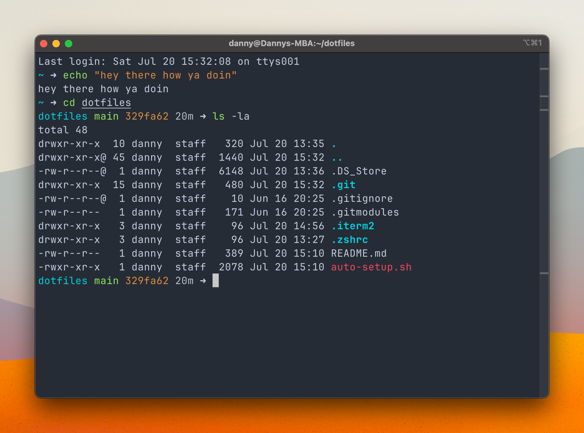

## Steps to install
1. Make sure you have [homebrew](https://brew.sh/) and [oh-my-zsh.](https://github.com/ohmyzsh/ohmyzsh?tab=readme-ov-file#basic-installation)
2. Run the following command, which will install my dotfiles and any needed plugins:

`bash -c "$(curl -fsSL https://raw.githubusercontent.com/dsrosen6/dotfiles/main/resource/setup.sh)"`

If you'd like to use my iTerm settings, go to iTerm's Settings > General > Preferences, check "Load preferences from a custom folder or URL", then pick the .iterm2 folder in this repo.

## What's it look like?
Like this!

